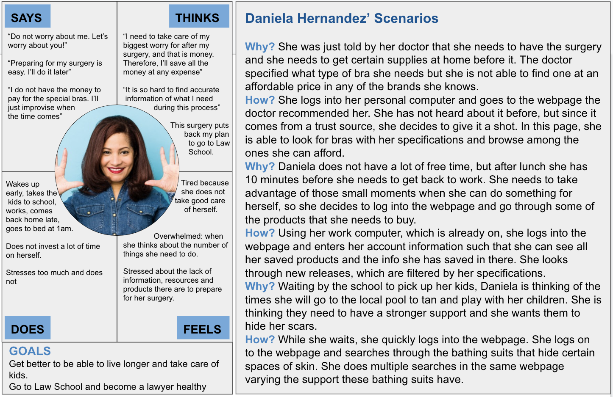

# Assignment 05 - UX Storytelling: Persona + Scenario

1. Short introduction about the purpose of ux storytelling in your project
The goal of UX storytelling is to provide a user perspective to the designer to be able to gain insight from that point of view. It helps stablish an example person belonging the target group.

2. Two features you want to propose for the ux design:
- Accesibility of specific products.
- Providing information to the uneducated mind.

3. Persona + empathy map (at least TWO) and  Scenario + Journey map (per each feature)

