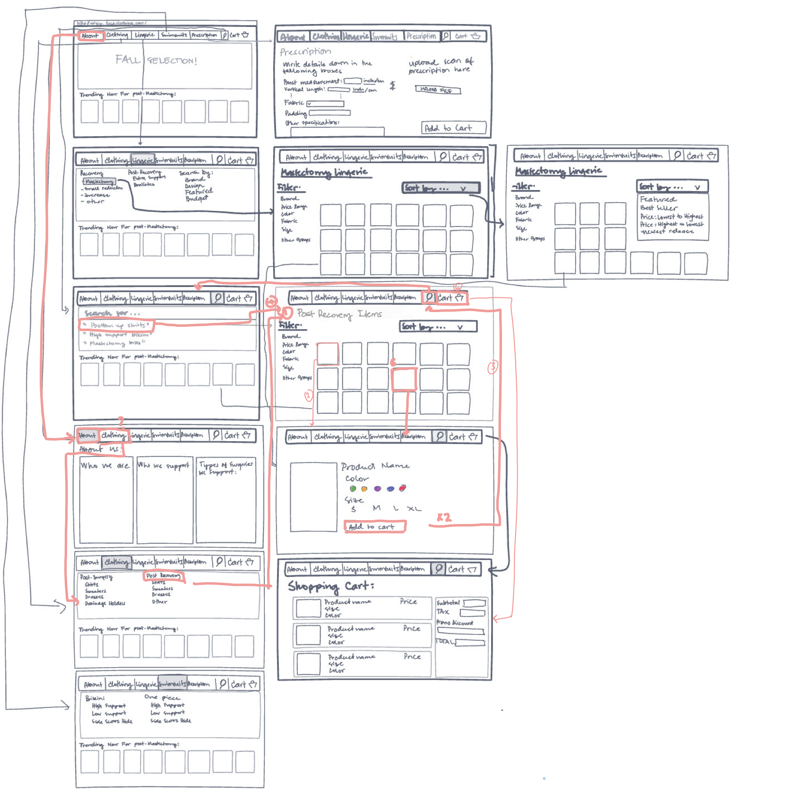

# Low-fidelity prototype:

## A brief description of your project and purpose of this low-fidelity prototype.
The current project consists on a webpage for middle age women who are going through, or about to, a upper chest procedure and are seeking for the right clothing for their recoveries and life after. These women also seek more information and to have informed opinions about the products that are being sold.

Target persona: middle age women, of any background, who has gone or will go through a upper-chest surgery. This group tends to have to look for information and products in multiple sources, and eish there was a source that had it all. Having all the information in one place helps you save time and helps the user not spend a lot of time looking into unreliable or non-detailed pages. It also allows a platform for these women to have a place where all these products are being sold and that suggest where could similar products could be searched for.

## List of tasks that the (paper) prototype of your system supported.
- Search bar field

- Main menu bar and submenus

- Select a category

- Add an item to a car

- Filtering using different criteria

## Wireframes and Wireflow:
#### Flow Description: #### 
The flow chart allows the user to browse through the different products being sold. You can use the main menu bar to search for items ot use the search bar. After choosing an item, you can add them to the cart with your size and color preferences. When searching the items, you can filter them by price range, color, item type, fabric and brand. Items can also be sort by price (low to high and high to low), best sellers, new releases and featured. You can also order personalized items and find more information about the webpage and the surgery items they support.

You can find a copy of the Wireframe and the 2 interactions [here!](https://freehand.invisionapp.com/freehand/document/N1dYUuXmA)

[Here is an image of the Wireframe:](https://github.com/isabelroig/DH-150---Isabel-Roig-Penso/blob/main/Assignment06/lfp1.png)

## A set of pictures of the prototype in different states, showing it being tested.

### Interaction #1

Confusions and/or unexpected interactions:
The user, when attempting to sort the items by price, tried to filter the items by price range. I noticed this function was not defined in the low-fidelity and guided the user into the page they should use. Besides this, the user felt pretty confident in her actions and managed to use the wireframe confidently.

### Interaction #2

Confusions and/or unexpected interactions:
When the user tries to find more information about the webpage, the wereframe does not support it, so the user was a little confused as to what to do next. She got frustrated and anked if she was doing something wrong. After this, she decided to explore other areas of the webpage and was able to smoothly use the Low-fidelity wireframe.

## A description of what you would change or design differently based on the feedback you got from the prototype testing. For each, describe in a sentence or two what problem the tester encountered, and in another sentence or two how you would address the problem if you were to revise the prototype.

The main problem the user encounter was running int undefined functions. I would start by designing the undefined functions such that the users do not get frustrated or stuck in the use of the webpage. Afterwards, I wuold ask the users to follow their actions up top the point they ran into the flow error and ask them to continue freely from there. This will allow the users to try the function and its accessibility.
