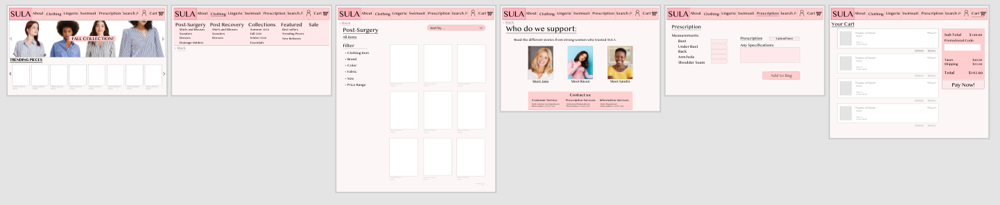
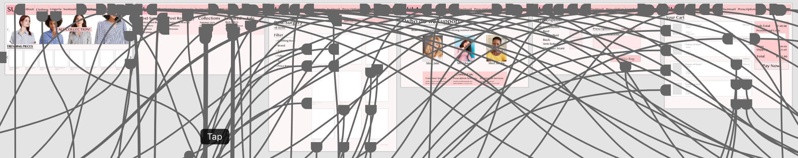
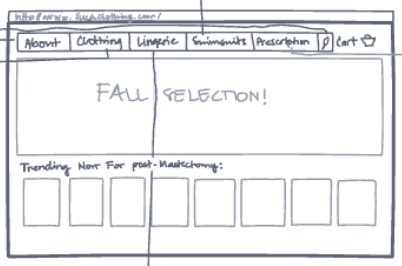
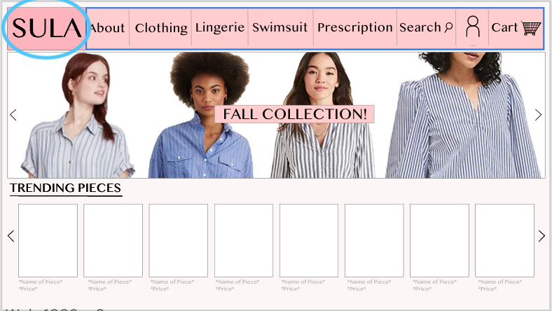
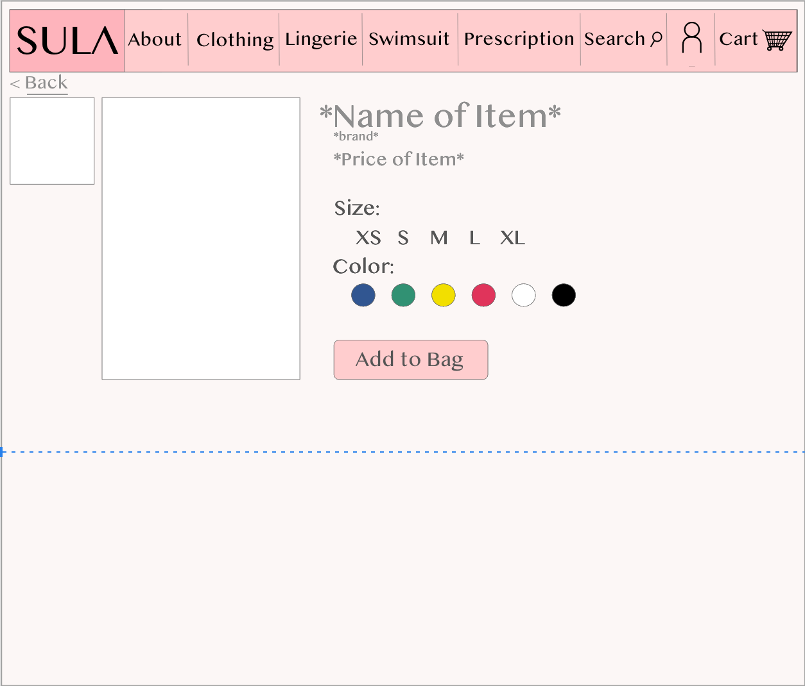
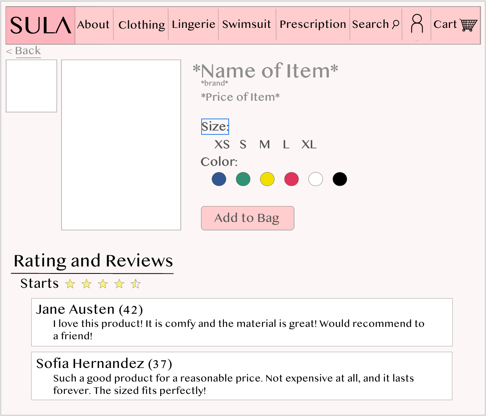

# Assignment 7: Interactive Prototype

The High Fidelity Prototype can be accessed [here](https://xd.adobe.com/view/ef780be9-9973-4dfa-88fd-9e470c9ff6f4-ba2b/).

## Brief description: Purposes and Process
The previous project is a high-fidelity prototype of SULA, a clothing store specialized for women who are going to get some type of breast surgery or are recoveriong from such. This prototype is meant to examine the functions of the webpage based on the personas. The prototype is created by Adobe XD and it is based on the low-fidelity prototype done in Invision. The functions that the prototype supports are based on previous testers of more robust models.

## Tasks Suppoerted by High Fidelity Prototype
- Access the main menu.
- Use the search bar.
- Add, access, edit and delete items from teh shopping cart. 
- Order personalized items
- Sort items using different criterias.

## Prototype Design
These are the main page designs of the whole high fidelity prototype.

## Wireflow Graphic Design
Since the project is much more complex when design

## Color
The color scheme of the page was always meant to have related colors to those of breast cancer, since the majority of the customers from this page would have a experience related to it. The pink tones were aimed to be smooth so the human eye would not get tired, while reminding the user that it is a page that specializes in clothing for women who will go through or have gone through some type of upper body surgery, which generally relate to breast cancer. 

## Evidence of Accessibility (color-contrast at least) check.
SOS

## Peer Review: Impression test
Andreina Penso, November 30th, 2020.

First Impression: "Wow, it is very pink. Is there a specific theme for the page? Looks like it is breast cancer related." \n
"Buttons are big and clear to read" \n
"Love how you can browse through different sections easily"
"Ohh, for some reason I cannot access the Bikini section. What is happening? I was able to access everything else"
"The about page should have more information I think!"
"The top menu has a lot of categories. I like it!"
"The product search tool is good"
"Nice to see you can sort by different criteria"
"Does the products have reviews?"
"I cannor access the wishlist."
"The cart has an option for discounts! Nice!"

You can find the screen recording  .

## In Class Cognitive Walkthrough
Due to time change issues, I could not attend class the day of the peer-review.

## Revisions
If you have multiple versions of prototypes by reflecting the evaluation with others, provide them with the description of what you learned from other’s feedback and what you have made the changes
The usability testings of the competition websites, the testing of the low fidelity model and the Impression Test made me do certains changes to my high fidelity prototype. The changes I did in regards to these revisions were:

1. Include Main Menu Button (change done from low fidelity prototype)

2. Include reviews and rating for products.
During the Impression test, the participant mentioned that a review section of the product was missing. This is an impprtant part of the
 ; 

3. Fixed Flow errors (missing flow arrows).
In the Impression Test, the user ran into some flow errors. It turns out that the high fidelity model had multiple flow arrows missing, so I went back and made sure all the flow arros of the high fidelity chart were present

