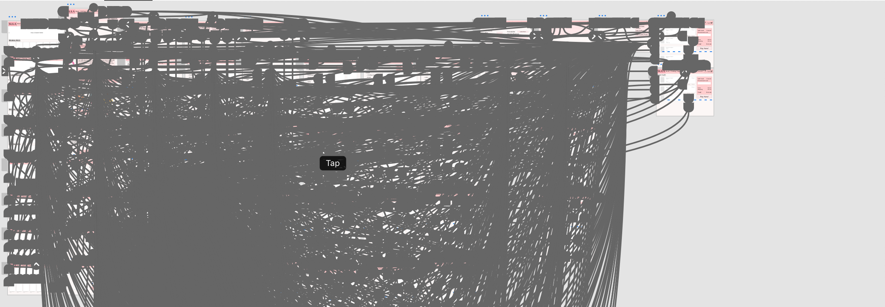

# Assignment 7: Interactive Prototype

The High Fidelity Prototype can be accessed [here](https://xd.adobe.com/view/a3946404-4c90-4fd2-b220-3980685c3ce4-f6c7/) .

## Brief description: Purposes and Process
The previous project is a high-fidelity prototype of SULA, a clothing store specialized for women who are going to get some type of breast surgery or are recoveriong from such. This prototype is meant to examine the functions of the webpage based on the personas. The prototype is created by Adobe XD and it is based on the low-fidelity prototype done in Invision. The functions that the prototype supports are based on previous testers of more robust models.

## List of tasks that the interactive prototype of your system supported.
- Access the main menu.
- Use the search bar.
- Add, access, edit and delete items from teh shopping cart. 
- Order personalized items
- Sort items using different criterias.

## Prototype Design

## Wireflow Graphic Design

## Color
The color scheme of the page was always meant to have related colors to those of breast cancer, since the majority of the customers from this page would have a experience related to it. The pink tones were aimed to be smooth so the human eye would not get tired. 

Description of your decision making of the graphical interface design, including the choice of the color scheme and note if you considered/checked accessibility color contrast.

## Peer Review: Impression test

## Evidence of Accessibility (color-contrast at least) check.

## Revisions
If you have multiple versions of prototypes by reflecting the evaluation with others, provide them with the description of what you learned from other’s feedback and what you have made the changes
### In Class Cognitive Walkthrough
Due to time change issues, I could not attend class the day of the peer-review. Because of this, I asked a friend of mine to do a Cognitive Walkthrough of my page.

