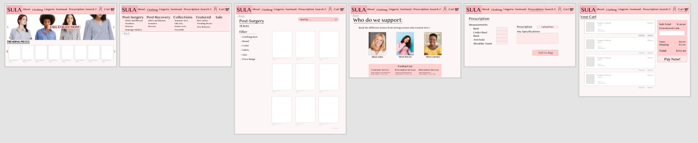

# SULA
## Isabel Roig Penso

### Introduction: a brief information about the project. 
*SULA* is a women's clothing store that specializes in clothing, swimsuits and lingerie for women who will go through or have gone through a upper body surgery. The clothing selection is based on these women's needs and preferences. It also provides information about these surgeries and promotes the creation of a community. This clothing store will be able to provide buying options for all the necesities of these women.

### Clear Design statement: 
It is hard for this group of women to find ideal clothes for their recoveries and future lives with their new bodies. They are entering the process with one body and exiting with a completely different one. Most of them lose the touch sense in that are and need to have specific clothes that help them stay comfortable. Most of the reason these women go through these surgeries are related to breast cancer, and a lot of information has to be learned really quickly. There are a lot of things that they need to do, so they have very little time to look for adequate clothing. There is no specialized store for this group of women, just small sections in departamental stores, so *SULA* will provide this group of women with this space.

### Competitor Analysis: [Heuristic Evaluation](https://github.com/isabelroig/DH-150---Isabel-Roig-Penso/tree/main/Assignment01)

When designing a clothing website, it is important to evaluate similar competitors, analyze their strengths and weaknesses so your product beats the former and improves the later. In the case of clothing store for women with upper body surgeries, there is not a specific store they can use. The best resource to find products for these women would be sections of departamental stores, such as [Nordstrom](https://www.nordstrom.com/browse/women/clothing/underwear-lingerie/breast-prosthesis-program) and [Target](https://www.target.com/c/mastectomy-swimsuits-women-s-clothing/-/N-e5wla). The heuristic evaluation was done to these webpages since these are the closest competitors to what would be a specialized post-breast surgery and recovery store.

<table>
<tr>
<td>  </td>
<td>  </td>
</tr>
</table>

### Competitor Analysis: [Usability Testing](https://github.com/isabelroig/DH-150---Isabel-Roig-Penso/tree/main/Assignment02)
After our initial findings of the heuristic evaluation, we conducted the pilot usability test and gather more information for our reserch. During the pilot usability test, the researches oberves the webpage and its accessoryhas and how easy are for the daily user to use. This is an opportunity for the researcher to analyze the page from the point of view of a non-trained individual. The usability test was performed in [Nordstrom](https://www.nordstrom.com/browse/women/clothing/underwear-lingerie/breast-prosthesis-program), since there are not a lot of options when it comes to specialized post-upper body surgery stores and it was the one that performed the best in the heuristic evaluation. 

You can find the link for the Pilot UT video [here](https://drive.google.com/drive/folders/1N5wqfa-coTNO7T3qng6g0WH60J0a8Lvp?usp=sharing) . 

<figure class="video_container">
  <iframe src="https://drive.google.com/drive/folders/1N5wqfa-coTNO7T3qng6g0WH60J0a8Lvp?usp=sharing" frameborder="0" allowfullscreen="true"> </iframe>
</figure>

### User Research: [Contextual Inquiry](https://github.com/isabelroig/DH-150---Isabel-Roig-Penso/tree/main/Assignment04)
The *user research* is a way to recieve and understand the point of view of a person that is part of the desired dedmographic of customers. It is based on the results of the *heuristic evaluation* and the *usability testing*. The user research section of the project allows a lot of flexibility when it comes to the method selected. The chosen method for this study was interview. The interview consisted of a series of contextual inquiry questions and hardships with her experience and how it can be improved. It also included a small UT section, with teh goal of understanding the familiarity of the demographic group with the competitor. Due to the COVID-19 pandemic, the interview took place through Zoom.

### UX storytelling: [Persona+Scenario](https://github.com/isabelroig/DH-150---Isabel-Roig-Penso/tree/main/Assignment05)
UX story telling is the next step of this research. The idea of this process is for the researcher to understand better the point of view of the desired demographic population or a target group for the product. The main features used for the UX Design are:
- Accesibility of specific products.
- Providing information to the uneducated mind.

<table>
<tr>
<td>  
</td>
<td> 
</td>
</tr>
</table>

### Wireframe and graphic design element variation

#### Low-fidelity Prototype [Wireflow](https://github.com/isabelroig/DH-150---Isabel-Roig-Penso/tree/main/Assignment06)
Summary and link to the sketches (may contains the multiple versions and evaluation history)
The low-fidelity prototypes are aimed to create the initial design of the website and to test the flow of a website without distracting features. It can easily be altered. This prototype kept in mind a middle age women who doe snot have a lot of free time for herself, from different economic backgrounds. This made me kept in mind the technological experience and skills of these women. This prototype allows the user to: 

- Use Ssearch bar 
- Use main menu bar and submenus
- Use select a category
- Use add an item to a car
- Filter using different criteria

The low-fidelity prototype can be found [here!](https://freehand.invisionapp.com/freehand/document/N1dYUuXmA)

 

#### High-fidelity Prototype [Functional/Interactive Prototype](https://github.com/isabelroig/DH-150---Isabel-Roig-Penso/tree/main/Assignment07)
The high fidelity prototype's goal is to further develop teh previous prototype by addiing complexity and more interactions. My high-fidelity prototype supports the main tasks a shopping webite has: access the main menu, use the search bar, add, access, edit and delete items from the shopping cart, order personalized items, sort items using different criterias.

The High Fidelity Prototype can be accessed [here](https://xd.adobe.com/view/ef780be9-9973-4dfa-88fd-9e470c9ff6f4-ba2b/)

### Evaluation and Revision History: [(Second Part Of Assignment)](https://github.com/isabelroig/DH-150---Isabel-Roig-Penso/tree/main/Assignment07)

The evaluation of the project were done through the cognitive walkthrough; impression test, accessibility audit and usability testing. These all provided different feedback about the project. Among the main findings we can find:

- Some missing objects were: main menu buttin, review section for products, newsletter and social media links.
- Missing information
- Missing interactions
- No wishlist access

### Pitch video (TBD)

### Conclusion

There are many valuable lessons that I learned during my project development of DH150, *SULA* :

- Benefits of different types of testing: The whole process included multiple research methods and testings, which all helped learn new information about the comnpetitors, the project itself and the demographic group the project was being designed for. The heuristic evaluation draw conclusions from a trained mind, while the UT allowed the user to see the page from a less trained mind, and be able to ake comparisons.

- Computing Design: creating the designs digitally allowed me to make changes very easily whenever necessary. When developing the low-fidelity prototype, I started doing it on pen and paper, but I realized it was really complicated to make changes. Whenever I wanted to make a change, I had to be really careful about not altering the other functions. When I passed the process to the computer, it was much simpler to edit and delete aspects of the project without risking the wants that I wanted to keep.

- Graphic Design: I knew from before graphic design was an important aspect of a webpage, but this experience allowed me to appreciate the effort it goes behind the thinking and choosing of aesthetics. Color schemes are an important part of designing a webpage, which can alter the experience of the user. The contrast between the background color and the text color has to be significant for the product to be smooth for the human eye (4.5:1)

- Importance of multiple testing: Everytime some type of testing was done either for the research process or to my prototypes, I learned something new that helped me optimize the process. This is due to teh fact that all minds work differently and that these minds tend to pay more attention to different aspects. But is is also important to be concious about how to optimize the testing. For example, in UT, 5 participants optimizes the finding of problems, and 14-20, for large groups.

