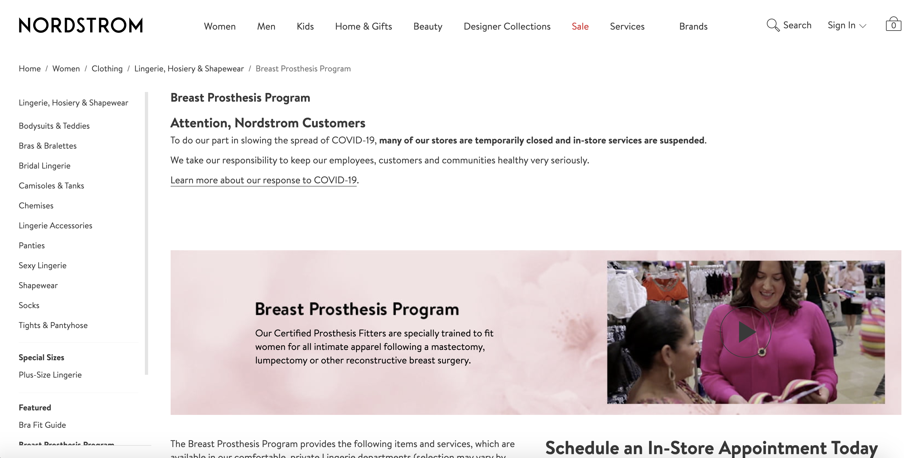
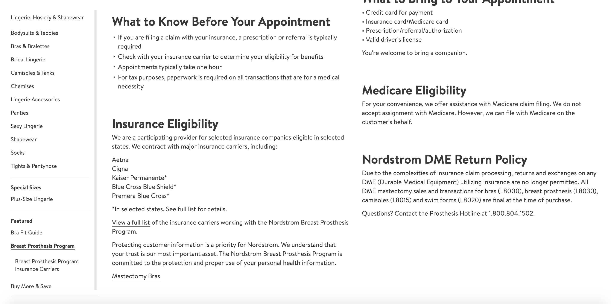
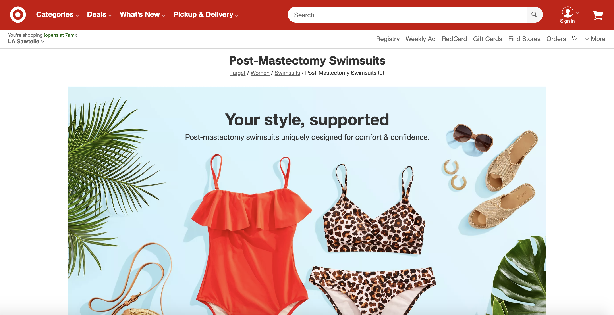
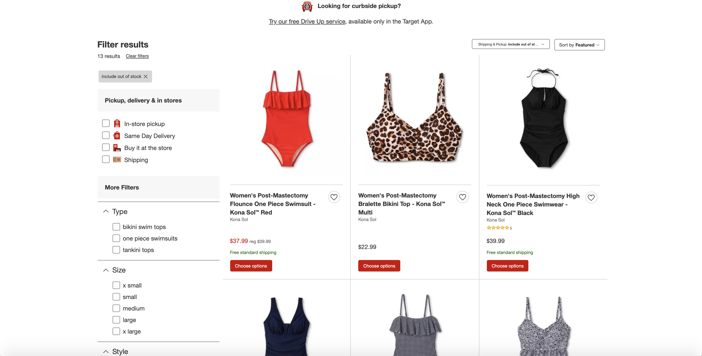

# Assigment 1 - DH150 F20
### Isabel Roig Penso - DH 150 F2020
(Possible) Title: SULA

Middle age woman brand of clothes, concentrated for formal events and outings. It will also offer bathing suits and lingerie that are comfortable for the middle-age woman. The special element of this page is that it sells clothes for women who had had masectomies. It is hard for them to use certain pieces of clothes because they have lost the feeling ability of their skin in this area, and it is hard for them to feel attractive and to reach happiness in their own bodies. There are not so many brands of clothes that have as a goal the comfort of this group. Among other difficulties that this group runs into includes lack of flexibily, pain, 

## Webpage #1: Nordstrom Post Breast Prosthesis Program
url: https://www.nordstrom.com/browse/women/clothing/underwear-lingerie/breast-prosthesis-program

Screenshot: 

### Initial Evaluation of Webpage:

The webpage is very informative of the program. It shows the services it offers, the different ways of payment through insurance or credit. The page focuses more on the ways to make an appointment and get a consult instead of the products its sells. In fact, the link for the items that are being sold onlone is found at the very bottom and it is easy to overlook. Even though it is a webpage focused for selling clothes, the section for post-masectomy clothes, especially bras, is not very well signaled. You either have to use the search box or know of the existance of this main page.

### Heuristic Principles:

#1: Visibility of system status.

The visibility of system status is very good. The webpage allows you to see where you are standing, under which subcategories you can find the webpage you are in, different browsing options and how to return to the main page. The top is filled with the main menus, including the shopping cart and an option to see your profile in the page. And on the side, you can see the nearest sudivisions of the page you are in. I would rank it with a regular.

#2: Match between system and the real world.

The words used in the webpage are very coloquial and user friendly. There are no complex nor similar words without necessity. The only place where you might encounter more complex words are in the subcategories of lingerie, to differentiate the ocassion and design; but even then, there are other words included in the description that helps you differentiate the categories. I would rank it as good.

#3: User control and freedom.

Most of the control commands work very well and are very clear. The only command that is not clear is how to return to the home page. Instead of having a clear "Home" button, the logo of the webpage (in this case, Nordstrom) works as a help button. If this button is accessed, there is no clear way to return to the previous page without using the browser's return option. You have to access 2 subcategories to finally reach the link that will take you to the specialized browser for this type of clothe for the item. There is no subcategory for all items designed for post-mastectomy clothing. I would rank it as a regular.

#4: Consistency and standards.

The page is really consistent and has high standards that are followed all around. Both, the internal and external consistency, are very well designed and make the experience for the customer pleasant. All the elements within categories are easy to differentiate thank you to the variation of words the webdesigners use. Even if 2 words are similar, they include adjetives in the titles to make them diffderentiable to those that might not know the main difference. The normal elements of an e-commerce webpage are there: the shopping cart item at the top right, the general menu on top, the customer service option at the buttom, and a sidebar where similar subcategories appear. I wouold rank it as good.

#5: Error prevention.

There are litttle to none error prone situations. When it comes to slips from the user, the webpage is correctly designed to offer alternate solutions. If the user searches a word incorrectly written, the web searches is mart enough to suggest some categories that look similar to the mispelled search. When it comes to mistakes, there are no easy mistakes in the page. everything is correctly identified. EVen the shopping cart correctly indicated the number of items the user has placed there. I would rank it as good.

#6: Recognition rather than recall.

This heuristic principle is not the best on this page. As it was described in the Initial Evaluation, it is not cleared where the post-mastectomy bra section is located and how you can locate it. It is placed at the end of the page, in the same font and color as the rest of the texts, It is not located in a black box, like the "Find a store near you" feature is. The only thing that sets it apart is a delicate underline, which is not easily recognizable for the general user. I would rank it as regular.

#7: Flexibility and efficiency of use.

The flexibility of this page is very good. It allows the users to have their personalized page (when the user logs in) and keep track of items they liked or want to shop. It follows the same format for all users, with the exception of their name. When searching through different items, it offers items that the user has searched before or that are similar to items that are similars to those searched before. I woud rank it as good.

#8: Aesthetic and minimalist design.

The design of the webpage is very minimalistic and aestetically pleasing. It is composed mainly of whites, greys and blacks, allowing the pictures to come up more easily to the eye and even these try to match the motive of the exact section of the page you are in, while folowing the aesthetics of the general page. In the case of the post-mastectomy page, it has images that show soothing pinks. Even the woman in the main picture of the page is earing a pink sweater. All the texts have the same fonts and ceratain preset letter sizes, having the biggest letters in the most important texts and decreasing the size of the texts as the text decreases importance. I would rank it with a very good.

#9: Help users recognize, diagnose, and recover from errors.

This heuretic principle is very good in this page, since it gives the user action options when it runs into an error or a bad end. The page offers similar options to what yoiu have been looking at or an option to return to the main menu. If you access a section of the page taht is no longer available, it will show an message sqaying that there was a problem with teh page and an option to return to the main page. I woud rank it as good.

#10: Help and documentation

There is a helper menu at the bottom of the page, where you can find the Customer Service option. The customer service option shows you main concers, such as how to cancel an order and where to call for general customer service. It also shows differe4nt phone numbers for specializedd customer service. I would rank it as good. The side menu shows main concerns and links to tutorial on how to do things, such as payment, pickup instructions and frequently asked quesions, where more explanations xan be found. I would rank it as good. 

## Webpage #2 - Target Swimsuits for Post-Mastsectomy Women

url: https://www.target.com/c/mastectomy-swimsuits-women-s-clothing/-/N-e5wla

Screenshot: 

### Initial Evaluation of Webpage:

Target's main page is really good. The page is very user friendly with very clear wording and access to the different sections. The section being analyzed is the swimsuit section for post-mastesctomy women. The page is basically the section fo a brand exclusive to target that designs swimsuits for the previously mentioned group. It is aesthetically pleasing and has colorful images that attracts the human eye.

### Heuristic Principles:

#1: Visibility of system status.

Same as the previuosly analyzed webpage, the visibility of the system status of this webpage is really good. It is clear where you are standing, under which subcategory and how to return to previous pages. It is clear which texts refer to shipping, for accesing pther pages and how to save an item that the user does not necessarily wants to insert in the shopping cart. I would rank is as good.

#2: Match between system and the real world.

The matching of the system and the real world is very good The webpage does not have complex nor non-popular words to describe the items and the different parts of teh webpage. The items being sold have very clear descriptions in their name. All of the items on this section have "Post-Mastectomy" phraase in their names, making them easy to search if teh searchbox is used for this. I would rank is as good.

#3: User control and freedom.

The user cotrol ooptions are really easily identfied and easy to use. They are not hidden under a menu. For example, the filters to find exacts items of clothing aare really evident: found in a black-bordered box right beforethe items are shown. There is a clear option to clear some of the filters used or all the filters. This helps the users feel in control of their action while using the webpage. The only command that is not entirely obvious is the home button which is the store's logo (But it is widely known that this button takes you to the home page). I would rank is as good.

#4: Consistency and standards.

The webpage follows the aesthetics and standards of teh r4est of the webpage: white and red colors, subcategories menu to the left, main menu at the top and items for sale around the rest of the webpage. The external consistency is very good, following the general standards of clothing webpages. The internal consistency is good, but some fixes could be done, since it is supposed to be the post-masectomy site and instead is just showing an individual brand's site. I would rank it as regular

#5: Error prevention.

It is somehow complicated to run into an error in the webpage, yet not impossible. Everything is so well formatted and organized that errors are not prone to happen. When slips happen, for example: the user wrongly types an item, it does not always redirects you to the right option. Instead, it might redirect you to an completely unrelated area. This might be due to the fact that it is a multidepartamental store (not only clothing) and it is easier to match items with the mispelled item, yet this should not happen. I woud rank it as regular.

#6: Recognition rather than recall.

The webpage design is very good for easily recognizion and litte to no recalling. The different buttons are worded shortly yet specific enough for the user. I would rank it as good.

#7: Flexibility and efficiency of use.

#8: Aesthetic and minimalist design.

The design of the webpage does a good job in mantaining the style of the whole page. Rather than decorqated with special color or 

#9: Help users recognize, diagnose, and recover from errors.

#10: Help and documentation

